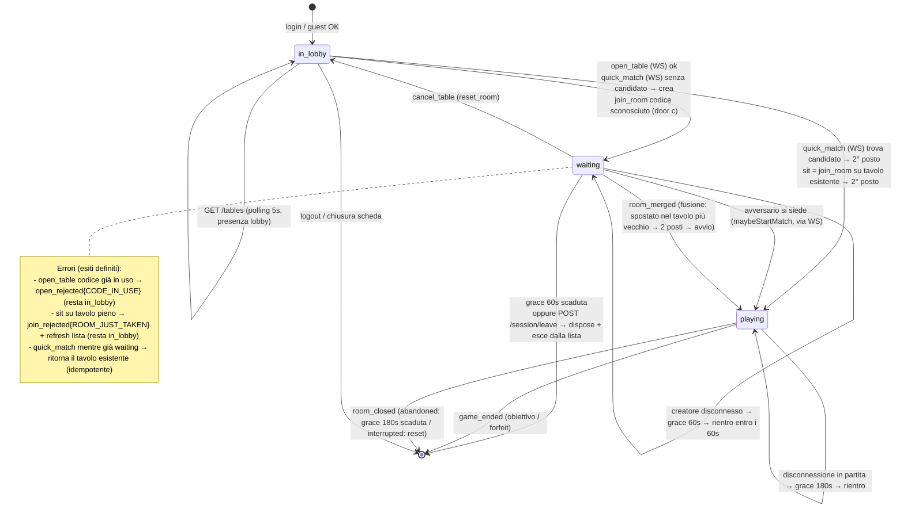
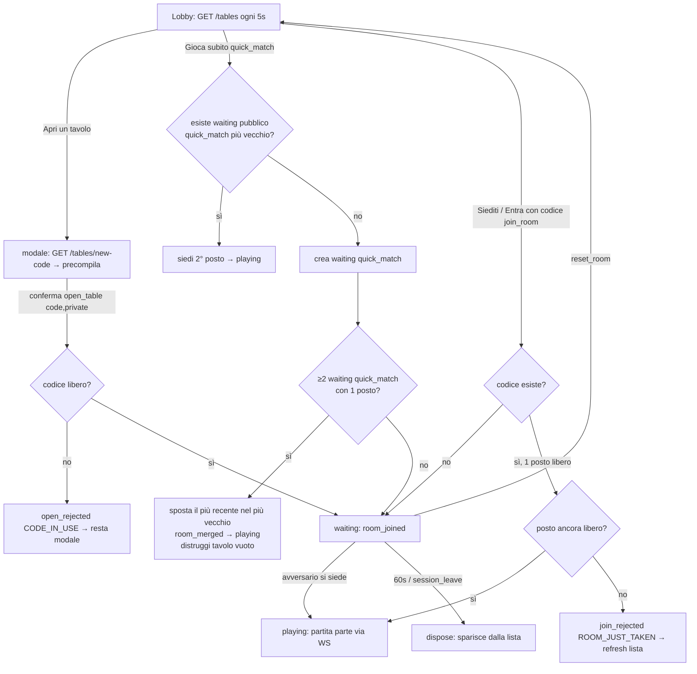

# ANALISI — Apertura tavoli, attesa visibile e anti-stallo in lobby

**Autore:** agente_analista (lead) · **Fase:** analisi (nessun codice applicativo) · **Brief:** [../prompts/PROMPT_LOBBY_TAVOLI.md](../prompts/PROMPT_LOBBY_TAVOLI.md)
**Stato:** consegna ad `agente_develop`

## Decisioni del lead recepite (post-ricognizione §4)
1. **Grace period:** 60s **solo** per il tavolo in attesa (`engine === null`); 180s in partita restano invariati.
2. Lista tavoli e beacon `POST /session/leave`: **non esistono**, si costruiscono da zero (confermato).
3. **Trasporto:** lista tavoli via **HTTP** (nuova rotta, con `RoomManager` wire-ato nell'app Express); apertura / quick-match / seduta / annullamento via **WebSocket** già aperto.

## Principi invarianti (da non violare)
- **Server-authoritative:** il client non decide mai visibilità, seduta, avvio o esistenza di un tavolo. Invia un'intenzione, riceve un esito.
- **Avvio partita solo via WS:** il polling HTTP aggiorna esclusivamente la lista in lobby; non fa mai partire una partita.
- **Identità solo dal token:** nome e `userId` si ricavano da `authToken`/sessione, mai da un parametro del client (già così in `RoomManager.handleJoin`).
- **Atomicità del posto:** nessun `await` tra controllo disponibilità e assegnazione (già garantito da `Room.join()` sincrono; nuovo codice deve mantenerlo).
- **Estendibilità 4 posti:** modellare `postiTotali`/`postiOccupati`; oggi il valore è sempre 2. Predisporre ≠ implementare.

---

# ITERAZIONE 1 — Modello degli stati e logica anti-stallo

## 5.1 I tre stati

| Stato | Dove si trova il giocatore | Ha WS aperto? | Visibile in lista? | Canale di aggiornamento |
|---|---|---|---|---|
| `in_lobby` | schermata lobby, sfoglia i tavoli | **no** (solo HTTP) | no | polling HTTP `GET /tables` ogni 5s |
| `waiting` | schermata tavolo, "in attesa di un avversario" | **sì** | sì, se `pubblico` e con socket vivo | WebSocket già aperto |
| `playing` | partita in corso | sì | no (tavolo pieno) | WebSocket |

**Mappatura sul codice esistente** — non sono tre oggetti nuovi, sono tre configurazioni della coppia (socket, `Room`):
- `in_lobby` = sessione autenticata **senza** WS e senza `Room` (oggi in lobby il socket non è nemmeno aperto: `useGameSocket.connect()` parte solo dopo `join`).
- `waiting` = `Room` con **1 posto vivo** ed `engine === null` (già esiste, oggi invisibile).
- `playing` = `Room` con **2 posti vivi** ed `engine !== null` (parte da `maybeStartMatch`).

**Cardine anti-stallo:** chi apre un tavolo apre **subito** il WS ed entra in `waiting`; la seduta dell'avversario arriva in tempo reale sul socket (`room_joined` → `maybeStartMatch` → `playing`), mai in dipendenza dal ciclo di polling.

### Diagramma degli stati



## 5.2 Attributi di un tavolo in stato `waiting`

Struttura (frammento indicativo — firma, non implementazione):

```ts
interface WaitingTableView {   // ciò che la lista HTTP espone (whitelist)
  code: string;                // codice normalizzato .trim().toUpperCase().slice(0,12)
  creatorName: string;         // display_name AUTORITATIVO del creatore (mai dal client)
  openedAt: number;            // epoch ms apertura → "attende da MM:SS" lato FE
  seatsTotal: number;          // = config.numeroGiocatori (oggi 2)
  seatsTaken: number;          // posti con socket VIVO (oggi 1 in waiting)
}

// Stato interno alla Room (NON serializzato ai client):
//   visibility: "pubblico" | "privato"
//   origin:     "quick_match" | "apertura_manuale"
//   openedAt:   number
//   creatorClientId?: string   // per rilevare self-play (§5.4-D)
```

- `origin` è necessario perché **la fusione (§5.4-A) si applica solo a `origin==="quick_match"` e `visibility==="pubblico"`**.
- La lista **non** espone mai `visibility` dei privati (i privati non compaiono affatto), né `userId`, email, token, `origin`, `clientId`.

**Persistenza — in RAM, non su PostgreSQL.** Motivazione:
- lo stato `waiting` è effimero, ad alta rotazione (sub-secondo) e **legato a un WS vivo su una singola istanza** (decisione #5/#7 single-instance);
- persistere su Neon aggiunge latenza e una dipendenza per dati che diventano privi di senso appena il socket muore, e **reintrodurrebbe i tavoli fantasma** (una riga DB che sopravvive al socket è esattamente lo Scenario B);
- coerente con l'attuale `Map<string,Room>` in RAM e con il vincolo §1 "nessuna nuova dipendenza".

**Riavvio del backend (Render free, sleep/restart) — comportamento definito e comunicato:**
- tutti i tavoli `waiting` e le partite in corso spariscono (stato in RAM perso);
- i WS cadono → il FE riconnette automaticamente (`useGameSocket` già lo fa) e reinvia il primo frame con il codice memorizzato;
- per un tavolo `waiting`: il creatore riconnette e il suo tavolo viene **ricreato trasparente** (vuoto) sotto lo stesso codice → l'attesa riprende; la lista è vuota subito dopo il riavvio e si ripopola man mano;
- per una partita in corso: **non è ripristinabile** (lo stato engine non è persistito per il resume) — **limitazione preesistente**, non introdotta qui; il FE mostra lo stato di riconnessione e, in assenza di stato, resta in attesa;
- **non si produce mai uno stato incoerente**: o il tavolo esiste (socket vivo) o non esiste (assente dalla lista). Nessuna riga orfana.

## 5.3 Le tre porte d'ingresso (coesistono senza sovrapporsi)

### (a) "Apri un tavolo" — `open_table` (WS)
- La modale mostra un **codice precompilato dal server** (vedi formato sotto), **modificabile**, più la casella **"Tavolo privato — non mostrarlo in lista"**.
- Il codice precompilato si ottiene con `GET /tables/new-code` (HTTP, contesto lobby senza WS) al momento dell'apertura della modale.
- Alla conferma, il FE apre il WS e invia `open_table { code, private }` (origin = `apertura_manuale`).
- **Codice già in uso** → `open_rejected { code: "CODE_IN_USE" }`; la modale resta aperta con messaggio leggibile ("Questo codice è già occupato, scegline un altro o lascia quello proposto"). Il server **non** fa sedere al tavolo altrui (nessun takeover silenzioso).
- Esito ok → il creatore è seduto (`room_joined`, `resumed:false`) → schermata `waiting`.

**Formato del codice** (leggibile e dettabile a voce, **decisione lead**): **5 caratteri** da un alfabeto senza ambiguità
`ABCDEFGHJKMNPQRSTUVWXYZ23456789` (31 simboli: esclusi `I`, `L`, `O`, `0`, `1`). Spazio ≈ 31⁵ ≈ 28,6 milioni di combinazioni, con ampio margine anti-collisione. Generazione: estrai → verifica non in uso → riprova (poche iterazioni). Rispetta il vincolo UI esistente (max 12, maiuscolo forzato).

### (b) "Gioca subito" — `quick_match` (WS)
- Il FE apre il WS e invia `quick_match {}`. **Tutta la decisione è del server:**
  1. cerca il tavolo **pubblico** `waiting` di `origin==="quick_match"` con 1 posto occupato **più vecchio** (`openedAt` minimo);
  2. se lo trova → ci fa sedere il giocatore (2° posto) → `room_joined` → `playing`;
  3. se non lo trova → apre un nuovo tavolo pubblico `origin="quick_match"` con codice generato → `waiting`, poi esegue il **controllo di fusione** (§5.4-A).
- Il client invia **una sola richiesta** e riceve l'esito; non legge la lista né decide.
- **Idempotenza:** se la sessione ha già un tavolo `waiting`, `quick_match` **restituisce quello** invece di crearne un secondo (anti tavoli-fantasma, §6.1 rate-limit semantico).

### (c) "Entra con codice" — `join_room` (WS), invariato
- Percorso esistente del macro-ciclo 1: `join_room { roomCode }`. È l'**unico** modo per raggiungere un tavolo **privato** (bisogna conoscere il codice).
- Semantica invariata: codice sconosciuto → si diventa creatori di un nuovo tavolo `waiting` (comportamento attuale, mantenuto per non rompere il flusso "accordatevi su un codice" e la suite di test esistente).
- La "Siediti" della lista è **la stessa operazione** `join_room` con un codice pubblico noto → riempie il 2° posto → `playing`.

Il flusso è **identico per registrati e ospiti**: nessuna porta è riservata.

## 5.4 Anti-stallo — i quattro scenari

### Scenario A — la simmetria (due "Gioca subito" simultanei)
**Difesa primaria (già garantita dall'architettura):** `quick_match` è un handler WS **sincrono dopo** la risoluzione dell'identità. Poiché Node è single-thread e non c'è `await` tra "cerca candidato" e "crea/siedi", le due richieste si serializzano: la prima crea `T1`, la seconda **trova `T1`** e ci si siede. Il doppio-create non avviene, purché il develop rispetti l'ordine **`await` identità → blocco sincrono (cerca+crea/siedi)`**.

**Difesa secondaria — fusione (decisione §3, opzione A), come rete di sicurezza deterministica:**
- **Dove:** eseguita **sincronamente subito dopo** la creazione di un tavolo `waiting` di `origin==="quick_match"` (dentro lo stesso handler, prima di rispondere al client). **Nessun tick periodico**: la difesa primaria già previene il caso comune, un timer aggiungerebbe complessità e superfici di corsa.
- **Regola:** se esistono ≥2 tavoli `waiting` **pubblici** `quick_match` con **1 solo occupante** ciascuno, il server sposta l'occupante del tavolo **più recente** (`openedAt` maggiore) dentro quello **più vecchio** e **distrugge** il tavolo rimasto vuoto. L'ordinamento per `openedAt` rende l'esito deterministico e impedisce ping-pong.
- **Cosa vede lo spostato:** evento socket **`room_merged { newCode }`** → il FE aggiorna il codice tavolo e mostra una spiegazione ("Ti abbiamo unito a un tavolo già in attesa: la partita sta per iniziare"). Non si ritrova altrove senza spiegazione. Subito dopo arriva `room_joined`/`state` del tavolo unito → `playing`.
- **Nessuna fusione concorrente incrociata:** il controllo gira **dentro la sezione sincrona senza `await`**, quindi due fusioni non si interfoliano; l'invariante di ordinamento (`openedAt`) è totale.

**VINCOLO ASSOLUTO:** la fusione tocca **solo** tavoli `pubblici` di `origin==="quick_match"`. Un tavolo `apertura_manuale` ha un codice che l'utente può aver già dettato a un amico; un tavolo `privato` è un invito a una persona precisa. **Non fondere mai** questi due tipi.

**Punto codice:** nuovo metodo `RoomManager.quickMatch(ws, principal)` + `RoomManager.mergeQuickMatchTables()` (opera su due `Room` + la mappa socket→room, quindi vive nel manager, non nella `Room`).
**Test:** due `quick_match` simultanei → un solo tavolo, due giocatori, nessuno appeso; lo spostato riceve `room_merged` e vede la spiegazione (§7).

### Scenario B — i tavoli fantasma (creatore chiude la scheda)
**Regola:** la **permanenza in lista è legata a un socket WS VIVO**, non a un record. Un tavolo `waiting` compare in `GET /tables` **solo se** ha ≥1 posto con socket aperto (`isSeatLive`), è pubblico e non pieno.
- **Chiusura pulita:** `POST /session/leave` (beacon `navigator.sendBeacon` su `pagehide`) → dispose immediato del tavolo `waiting` del richiedente. Via rapida.
- **Chiusura sporca:** alla `close` del WS parte un **grace di 60s** (decisione §3, non punire il cambio rete mobile); scaduto → dispose e sparizione dalla lista. Durante il grace il socket è morto ⇒ il tavolo **non è listato** (niente fantasma) ma **resta reclamabile** per 60s (rientro).
- **Grace state-dependent:** `Room.onDisconnect` sceglie la durata in base allo stato — `engine === null` (waiting) → **60s**; `engine !== null` (playing) → **180s** invariato.

**Non-reintroduzione dello "stale slot lockout":** il posto non viene "bloccato" da un token per-browser appeso. Vale la meccanica esistente: reclaim **solo** su posti **disconnessi** (`!isSeatLive`, SEC-04) e identità per-browser resiliente in RAM (`sessionIdentity.ts`). Un tavolo `waiting` con l'unico occupante in grace: se lo stesso browser rientra (stesso `clientId`/token) fa reclaim del posto disconnesso; se subentra un secondo giocatore, il branch (2)/(4) di `Room.join` reclama il posto disconnesso solo se non c'è un posto vivo, senza lockout. **Test dedicato di non-regressione** (§7).

**Avversario già seduto durante il grace del creatore:** in `waiting` c'è **un solo occupante** (il creatore); appena un secondo si siede si passa a `playing`. Quindi "avversario già seduto mentre il creatore si disconnette" è di fatto lo scenario **in partita**, coperto dal banner esistente `opponent_disconnected` con finestra 180s. Il FE mostra "{nome} ha perso la connessione — rientro in corso" con countdown esplicito della finestra.

**Punto codice:** `Room.onDisconnect` (durata grace condizionale), nuovo `POST /session/leave` + `RoomManager.leaveWaiting(sessionId)`; `GET /tables` filtra per `isSeatLive`.

### Scenario C — la corsa alla stessa sedia (due "Siediti" simultanei)
**Regola:** riserva del posto **atomica**. Nessun `await` tra controllo disponibilità e assegnazione: `Room.join()` è già sincrono e il single-thread di Node garantisce l'atomicità senza lock esterni. Il develop deve mantenere l'invariante anche in `sit`/`quick_match` (identità risolta **prima** del blocco sincrono).
- Al secondo giocatore va restituito un errore **tipizzato `ROOM_JUST_TAKEN`** (oggi la room piena manda un `error` generico in `Room.ts:246` → va sostituito, **solo nel caso pre-partita "pieno"**, con `join_rejected { code: "ROOM_JUST_TAKEN" }`). Il FE lo traduce in "Qualcuno si è appena seduto a quel tavolo" + **refresh immediato** della lista.
- La ricognizione conferma che **non esistono `await` nel percorso critico attuale** (`Room.join`), quindi non c'è un difetto da correggere qui; l'unico `await` è la risoluzione token a monte.

**Test:** due `sit` simultanei sullo stesso tavolo → uno entra, l'altro riceve `ROOM_JUST_TAKEN` e la lista si aggiorna (§7).

### Scenario D — seconda sessione dallo stesso browser
- Per il server due sessioni ospite sono **due giocatori distinti** (due `authToken`/`userId`). La seduta al proprio tavolo dalla seconda sessione è **permessa** (unico modo di collaudare senza un secondo dispositivo). Il `clientId` per-browser è condiviso tra le schede, ma il reclaim vale solo su posti **disconnessi**: due schede **vive** ottengono posti distinti (già così).
- **Rilevazione:** il server riconosce il self-play quando i due posti condividono lo stesso `clientId` (o lo stesso `userId`). Alla partenza della partita emette **`self_play_notice {}`** → il FE mostra un banner **non bloccante** "Stai giocando contro te stesso".
- **Esclusione dalle statistiche (raccomandazione minimale, entro scope):** quando i due posti condividono `clientId`, **non collegare `userId` al match** (persisti con `userId=null` per entrambi i posti). Le statistiche sono per `userId`: un match non attribuito **non comparirà** nelle stats di nessuno, **senza toccare la query di aggregazione**. Alternativa (se si preferisce tracciabilità): colonna `exclude_from_stats` sul match + filtro nella query — ma richiede una modifica al layer stats, da confermare col lead.

**Punto codice:** `Room.startMatch`/`maybeStartMatch` (rilevazione `clientId` condiviso → `self_play_notice` + `userId=null` in `addPlayers`).

---

# ITERAZIONE 2 — API e specifiche UI

## 6.1 Endpoint HTTP e messaggi WebSocket

**Regola di sicurezza trasversale:** l'identità del richiedente si prende **sempre** dal Bearer/`authToken`, mai da un parametro del client. Nessuna risposta espone tavoli privati né campi interni (`userId` altrui, email, token, `origin`, `clientId`).

### HTTP (nuovo)

| Rotta | Metodo | Auth | Payload req | Risposta | Errori | Rate-limit (proposto) |
|---|---|---|---|---|---|---|
| `/tables` | GET | Bearer | — | `{ tables: WaitingTableView[], lobbyPlayers: number }` | 401 no sessione | limiter `tables`: window 60s, max 40 (poll 5s = 12/min + margine) |
| `/tables/new-code` | GET | Bearer | — | `{ code: string }` | 401 | limiter `newcode`: 60s / 30 |
| `/session/leave` | POST | Bearer | `{}` (identità dal token) | `204` no content | 401 | limiter `leave`: 60s / 60 |

- **Lista vuota** → `{ tables: [], lobbyPlayers: N }` (200). Il FE mostra il testo §6.3.
- `GET /tables` funge anche da **heartbeat di presenza lobby** (aggiorna `lastSeen` della sessione), vedi §6.2.
- Nessuna delle rotte accetta un id utente dal client. `GET /tables` **non** elenca privati.

### WebSocket — nuovi messaggi CLIENT → SERVER

```ts
| { type: "open_table"; code: string; private: boolean }   // door (a); origin = apertura_manuale
| { type: "quick_match" }                                   // door (b); origin = quick_match
// door (c) "Entra con codice" e "Siediti": riusano join_room { roomCode } (invariato)
// "Annulla e torna alla lobby": riusa reset_room (invariato)
```

### WebSocket — nuovi messaggi SERVER → CLIENT

```ts
| { type: "room_merged"; newCode: string }                  // fusione §5.4-A
| { type: "open_rejected"; code: "CODE_IN_USE" }            // open_table su codice occupato
| { type: "self_play_notice" }                              // §5.4-D, non bloccante
// estensione del messaggio esistente join_rejected:
| { type: "join_rejected"; code: "AUTH_REQUIRED" | "AUTH_INVALID" | "ROOM_JUST_TAKEN"; reason: string }
```

**Ripartizione HTTP/WS** (coerente §5.1): la **lista** è l'unica cosa via HTTP (polling). **Apertura, quick-match, seduta, annullamento** passano dal WS già aperto, così l'avvio partita è in tempo reale e mai legato al polling.

**Rate-limit semantico anti tavoli-fantasma:** una sessione può detenere **al massimo 1 tavolo `waiting`**. `open_table`/`quick_match` mentre già `waiting` → restituisce il tavolo esistente (idempotente), non ne crea un secondo. Difesa aggiuntiva contro la creazione massiva, oltre al token-bucket per-socket già presente (`server.ts`).

## 6.2 Il contatore dei giocatori in lobby

**Cosa conta:** le **sessioni realmente in lobby** = sessioni che hanno effettuato un poll `GET /tables` entro una finestra TTL (proposta: **12s**, ≈ 2,4× l'intervallo di polling, per tollerare un poll perso) **e che non sono sedute** (né `waiting` né `playing`).
- **Esclude** chi è `waiting` (ha già un tavolo, compare nella lista, non nel contatore) e chi è `playing` (non disponibile).
- **Motivazione (onestà):** il contatore serve al neofita per decidere "se apro un tavolo, qualcuno lo vedrà?". Gonfiarlo con chi è già occupato produrrebbe un numero che non genera mai un avversario — peggio di nessun contatore. Conta solo chi può davvero sedersi.
- **Trasporto:** viaggia **nel payload di `GET /tables`** (nessuna rotta aggiuntiva).
- **A zero:** `lobbyPlayers: 0`; il FE mantiene il testo dello stato vuoto che invita comunque ad aprire un tavolo ("non significa che tu sia solo…").

**Punto codice:** registro `Map<sessionId, lastSeenMs>` aggiornato a ogni `GET /tables` autenticato; conteggio = entries con `lastSeen ≥ now-TTL` non associate a una `Room`.

## 6.3 Stato vuoto della lista — testo esatto (riprodotto alla lettera)

Quando `tables` è vuoto, al posto della tabella:

> **Nessun tavolo aperto in questo momento.**
> Non significa che tu sia solo: altri giocatori potrebbero essere in lobby proprio come te, in attesa. Ma finché qualcuno non apre un tavolo, non c'è nessun posto a cui sedersi.
> **Apri tu un tavolo:** comparirà nella lista di tutti gli altri entro pochi secondi.

Subito sotto, i due pulsanti d'azione — **"Gioca subito"** (primario) e **"Apri un tavolo"** — elemento più evidente della schermata (non un campo di testo passivo).

Quando la lista **non** è vuota, il testo di contorno cambia tono:
> Siediti a un tavolo esistente, oppure aprine uno tuo.

## 6.4 Le schermate

Vincoli di accessibilità a valle (per `agente_ui_ux`): **contrasto WCAG AA** e **nessuna informazione affidata al solo colore** (stato/origine sempre anche testo/icona). Responsive a **375px**.

### Lobby (`in_lobby`)
- **Contatore giocatori** in lobby (da `lobbyPlayers`).
- **Lista tavoli pubblici**: per riga → nome di chi attende (`creatorName`), da quanto attende (`openedAt` → "attende da MM:SS", timer locale), posti (`seatsTaken`/`seatsTotal`), pulsante **"Siediti"**.
- I due **pulsanti d'azione**: "Gioca subito" (primario), "Apri un tavolo".
- Campo **"Entra con codice"** (input max 12, maiuscolo forzato) + invio → `join_room`.
- **Stati:** vuoto (testo §6.3), caricamento (skeleton/"Aggiorno la lista…"), errore (banner "Lista non disponibile, riprovo…" con retry del polling).

### Modale "Apri un tavolo"
- Campo codice **precompilato** (da `GET /tables/new-code`) e **modificabile**; validazione già in uso (max 12, maiuscolo forzato, alfabeto suggerito).
- Casella **"Tavolo privato — non mostrarlo in lista"**.
- Esito `open_rejected{CODE_IN_USE}` → messaggio inline, la modale resta aperta.

### Schermata tavolo in attesa (`waiting`)
- **Codice in grande evidenza** (va dettato a voce o incollato in chat esterna) con pulsante "copia".
- "In attesa di un avversario…" + **contatore del tempo di attesa**.
- Per un tavolo **privato**: nota che spiega che **non compare in lista** e che il codice va comunicato.
- Pulsante **"Annulla e torna alla lobby"** (→ `reset_room`).
- Riusa il pattern esistente (`page.tsx` blocco `!g.state`), esteso con codice prominente + timer + nota privato + gestione `room_merged` (aggiorna il codice mostrato e spiega la fusione).

---

# ITERAZIONE 3 — Flow diagram e piano di test

## Flow — le tre porte e la fusione



## Tabella dei test funzionali
Collaudo su URL di branch Vercel, due sessioni ospite (due schede/finestre distinte, o due dispositivi).

| # | Caso | Esito atteso |
|---|---|---|
| F1 | Due ospiti in lobby, lista vuota | entrambi vedono il testo §6.3 + i due pulsanti |
| F2 | Un utente "Apri un tavolo" pubblico | compare nella lista dell'altro entro il ciclo di polling (≤5s) |
| F3 | Il secondo "Siediti" | la partita parte per entrambi **via socket**, senza attendere il polling |
| F4 | Due "Gioca subito" simultanei | **un solo** tavolo, due giocatori, nessuno appeso (fusione o serializzazione) |
| F5 | Fusione | il giocatore spostato riceve `room_merged` e vede la spiegazione a schermo |
| F6 | Tavolo privato | **mai** fuso e **mai** in lista |
| F7 | Tavolo pubblico `apertura_manuale` | **mai** fuso |
| F8 | Tavolo privato | raggiungibile **solo** digitando il codice |
| F9 | `open_table` con codice già in uso | `open_rejected{CODE_IN_USE}`, messaggio leggibile, nessun crash |
| F10 | Creatore chiude la scheda | il tavolo sparisce dalla lista dopo 60s |
| F11 | Rientro entro 60s | il tavolo sopravvive, l'attesa riprende |
| F12 | Due "Siediti" simultanei | uno entra, l'altro `ROOM_JUST_TAKEN` + lista aggiornata |
| F13 | "Annulla" il proprio tavolo | sparizione immediata dalla lista, ritorno in lobby |
| F14 | Contatore giocatori | coerente con le sessioni realmente in lobby (non gonfiato) |
| F15 | **Non-regressione stale slot lockout** | dopo disconnessione + rientro, il posto è di nuovo occupabile |
| F16 | Riavvio backend con tavoli in attesa | comportamento §5.2 (lista vuota poi ripopolata, creatore ricreato), mai stato incoerente |
| F17 | Seconda sessione stesso browser | seduta permessa, `self_play_notice` mostrato |
| F18 | `session/leave` (beacon) | chiusura pulita → dispose immediato, prima dei 60s |

## Tabella dei test di sicurezza

| # | Caso | Esito atteso |
|---|---|---|
| S1 | Payload di `GET /tables` | non contiene tavoli privati né campi interni (`userId`/email/token/origin/clientId) |
| S2 | `sit`/`join_room` su tavolo già pieno (richiesta forgiata a mano) | rifiutata lato server (`ROOM_JUST_TAKEN`), nessun 3° posto |
| S3 | Annullamento del tavolo altrui | negato (il socket può resettare solo la propria room via `socketRoom`) |
| S4 | Richieste senza sessione valida su tutte le rotte nuove | 401 (HTTP) / `join_rejected{AUTH_*}` (WS) |
| S5 | Rate-limit su `open_table`/`quick_match` | creazione massiva bloccata (max 1 `waiting` per sessione + token-bucket) |
| S6 | Codice forgiato dal client che collide con una stanza esistente | `open_table` → `CODE_IN_USE` (nessun takeover); `join_room` privato richiede il codice esatto (spazio 31⁵ + rate-limit) |

---

# GATE DI VERIFICA (§8) — esito

- ✅ Ogni transizione del diagramma ha un evento scatenante e un esito definito, incluse quelle di errore (`open_rejected`, `ROOM_JUST_TAKEN`, grace scaduta).
- ✅ Nessuna decisione §3 modificata senza segnalazione (il conflitto grace 60/180 è stato risolto dal lead: 60 solo waiting).
- ✅ La fusione esclude esplicitamente privati e `apertura_manuale`.
- ✅ Nessun percorso fa decidere lo stato del tavolo al client (server-authoritative).
- ✅ L'avvio partita passa dal WebSocket (`maybeStartMatch`/`room_merged`), mai dal polling.
- ✅ Documentata la non-reintroduzione dello stale slot lockout (reclaim solo su posti disconnessi + test F15).
- ✅ Comportamento post-riavvio backend definito e comunicato (§5.2).
- ✅ Ogni endpoint nuovo ha rate-limit, autenticazione e codici di errore tipizzati.
- ✅ Whitelist di file distinta BE/FE (sotto).

---

# CONSEGNA (§9)

## Whitelist dei file da modificare

**Backend (`BE_Burraco/`):**
- `src/contract/types.ts` — nuovi `ClientMessage` (`open_table`, `quick_match`); nuovi `ServerMessage` (`room_merged`, `open_rejected`, `self_play_notice`); estensione `join_rejected.code` con `ROOM_JUST_TAKEN`; DTO HTTP `WaitingTableView`, `TablesResponse`.
- `src/ws/validate.ts` — validazione di forma di `open_table` / `quick_match`.
- `src/room/Room.ts` — campi `visibility`/`origin`/`openedAt`/`creatorClientId`; grace condizionale 60/180 in `onDisconnect`; `join_rejected{ROOM_JUST_TAKEN}` al posto dell'`error` generico su "pieno pre-partita"; rilevazione self-play + `userId=null`; getter per la lista (`isWaiting`, `visibility`, `origin`, `creatorName`, `openedAt`, `seatsTaken/Total`).
- `src/room/RoomManager.ts` — `openTable`, `quickMatch`, `mergeQuickMatchTables`, `listPublicWaitingTables`, `findByCode`, `leaveWaiting`; registro presenza lobby (`Map<sessionId,lastSeen>`); routing dei nuovi messaggi in `handleMessage`.
- `src/http/app.ts` — nuove rotte `GET /tables`, `GET /tables/new-code`, `POST /session/leave`; nuovo parametro `manager: RoomManager`; nuovi limiter.
- `src/ws/server.ts` — passare `manager` a `createHttpApp` (unica modifica: trasporto invariato).
- `src/config.ts` — nuove env `WAITING_GRACE_MS` (default 60_000), `LOBBY_PRESENCE_TTL_MS` (default 12_000).
- *(condizionale)* `src/stats/*` — solo se si sceglie il flag `exclude_from_stats` invece dell'`userId=null`; da confermare col lead.

**Frontend (`FE_Burraco/`):**
- `src/lib/contract.ts` — mirror dei nuovi messaggi/DTO.
- `src/lib/useGameSocket.ts` — primo frame generalizzato (`open_table`/`quick_match`/`join_room`); handler `room_merged`/`open_rejected`/`self_play_notice`; API `openTable()`/`quickMatch()`/`sit(code)`.
- `src/lib/lobby.ts` *(nuovo)* — client HTTP: polling `GET /tables`, `GET /tables/new-code`, beacon `POST /session/leave` su `pagehide`.
- `src/app/page.tsx` — la lobby autenticata mostra lista + contatore + due pulsanti + "Entra con codice"; integra modale e schermata attesa estesa.
- `src/components/Lobby.tsx` *(nuovo)* — lista, contatore, azioni, stati vuoto/caricamento/errore.
- `src/components/OpenTableModal.tsx` *(nuovo)* — modale "Apri un tavolo".
- `src/components/WaitingRoom.tsx` *(nuovo o estensione del blocco esistente)* — codice prominente, timer attesa, nota privato, gestione `room_merged`.
- `src/app/globals.css` — stili lista/modale/attesa entro il design system esistente (nessun nuovo design system).

## Ordine di dipendenza dell'implementazione
1. **Contratto** (`contract/types.ts` BE + `contract.ts` FE) — sblocca tutto il resto.
2. **Room**: campi + grace condizionale + `ROOM_JUST_TAKEN` + getter + self-play.
3. **RoomManager**: `openTable`/`quickMatch`/`merge`/`listPublicWaitingTables`/`leaveWaiting` + registro presenza + routing.
4. **HTTP**: wiring `manager` in `createHttpApp` + `GET /tables`, `/tables/new-code`, `POST /session/leave` + limiter.
5. **WS validate/server**: validazione nuovi messaggi + passaggio `manager`.
6. **FE lib**: `useGameSocket` (primo frame + handler) + `lobby.ts` (polling/beacon).
7. **FE UI**: `Lobby` → `OpenTableModal` → `WaitingRoom` → integrazione in `page.tsx` → stili.
8. **Test** (F1–F18, S1–S6) sul branch deploy.

`OUTPUT PER: agente_develop`
