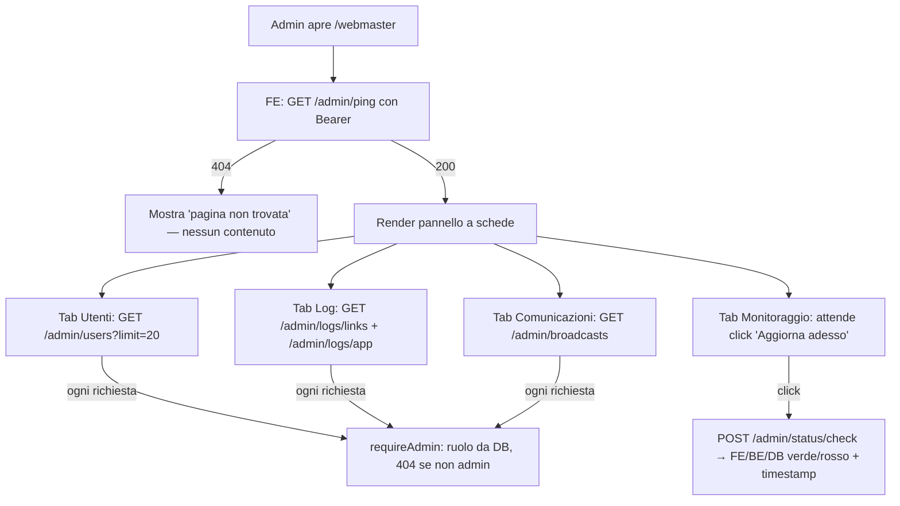
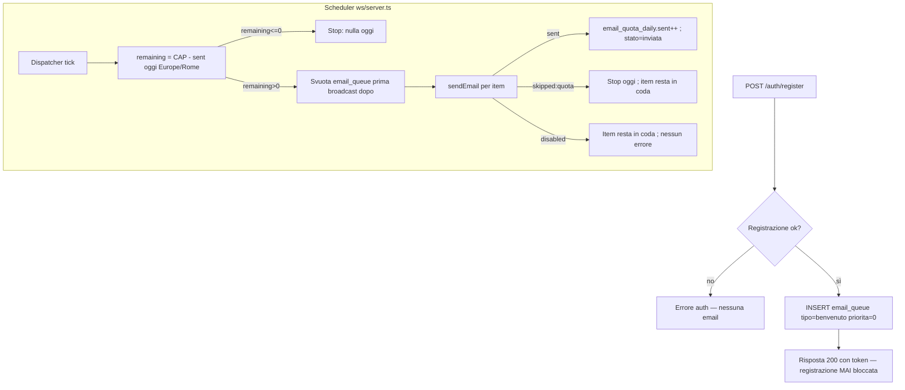
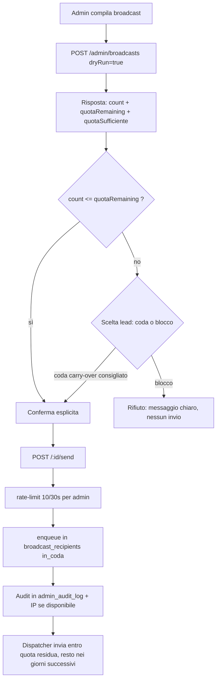

# ANALISI — PANNELLO AMMINISTRATORE E NOTIFICHE EMAIL

**Autore fase:** agente_analista (lead)
**Fase:** ANALISI (nessun codice applicativo; ammessi solo SQL, firme endpoint, nomi env)
**Branch:** `claude/admin-panel-email-notifications-987c6f`
**Destinatario a valle:** `agente_develop`
**Data:** 2026-09-22

> **Regola d'oro del task (§0 del prompt):** si tocca SOLO (a) un pannello amministratore a
> schede e (b) l'aggancio della welcome email al flusso di registrazione. Motore di gioco,
> statistiche, flusso ospite, lobby, WebSocket, contratto di GIOCO sono FUORI SCOPE.
> Grafica esistente su `main`: **non si toglie nulla**, si aggiunge solo lo stretto necessario
> integrandosi con layout/CSS già presenti.

> ### ⛔ VINCOLO GRAFICO INVALICABILE (feedback esplicito del lead)
> La grafica dell'app **non va modificata senza motivo**. Questo ciclo aggiunge SOLO l'area
> amministratore (`/webmaster`), che è una superficie a sé. È **VIETATO** a `agente_develop` e
> `agente_ui_ux` toccare, riscrivere o rimuovere:
> - `FE_Burraco/src/app/globals.css` (nessuna riga rimossa/riscritta)
> - `FE_Burraco/src/app/page.tsx` (schermata di gioco/lobby) se non per l'unico innesto della
>   voce di menu admin (§2.5), **additivo e condizionale**
> - `components/AuthPanel.tsx`, `components/ProfilePanel.tsx`, `components/SideFlanks.tsx`,
>   `components/VetrinaBrandHeader.tsx`, `components/Landing.tsx` e relativi stili
> - qualunque immagine in `FE_Burraco/public/images/**` (**mai** cancellare asset)
>
> Tutta la grafica del pannello vive **scopata** sotto `.webmaster-root` in `app/webmaster/`.
> Qualunque necessità di toccare la grafica esistente → **fermarsi e chiedere al lead**, mai
> improvvisare. Ogni `git diff` che tocca i file sopra fuori dall'innesto §2.5 è un errore da
> segnalare, non da "far passare".

---

## A. STATO REALE DEL CODICE (verificato, non riscoperto)

Gran parte dell'infrastruttura richiesta **esiste già** (ciclo "Contatti/Webmaster/Retention",
PR #37 mergiata). Questa analisi isola il **DELTA** effettivo di questo task.

| Area | Fatto verificato | Riferimento |
|---|---|---|
| Ruolo admin | Colonna **`users.role`** (`'user'\|'admin'`), **NON** `is_admin`. Additiva, default `'user'`. | `db/schema.ts:57`, mig `0006` |
| Gate admin | `createRequireAdmin()` risolve il principale dal Bearer e risponde **404** ai non-admin. Ruolo letto dal DB a ogni richiesta (token OPACHI, non JWT → revoca istantanea). | `admin/requireAdmin.ts:18` |
| Ruolo lato FE | `AuthUser` (DTO pubblico di `/auth/*`) **NON** contiene `role`: scelta di sicurezza deliberata. Il FE oggi non sa se sei admin. | `auth/types.ts:53` vs `:74` |
| Rotte admin | Montate sotto **`/admin/*`** (NON `/api/admin/*`). Il FE client punta lì. | `http/app.ts:616`, `lib/admin.ts:113` |
| Lista utenti | **`GET /admin/users` NON esiste** (Blocco A congelato al Gate 4 del ciclo precedente, mai mergiato). | grep su `http/app.ts` |
| Modulo email | `mail/` completo: `sendEmail()` punto UNICO, `fetch` nativo, timeout 8s, 1 retry, `skipped:quota` su 402/429, mai eccezione. | `mail/index.ts`, `mail/brevo.ts` |
| Broadcast | Tabelle `broadcasts`+`broadcast_recipients` (con `UNIQUE(broadcast_id,user_id)` = idempotenza). Worker async a lotti da **40/tick**. **NON quota-aware**: nessun contatore giornaliero, nessun pre-check. | `broadcast/service.ts:24,137` |
| Welcome email | **NON esiste.** `register()` crea l'utente ed emette la sessione, nessun invio. | `auth/service.ts:129` |
| Coda quota | **NON esiste** alcuna `email_queue` né contatore "inviato oggi". | — |
| Log Render/DB | Il ciclo precedente ha implementato il **proxy API** Render (`getRenderLogs`, env `RENDER_API_KEY`/`RENDER_SERVICE_ID`) e lo stato DB (`getDbStatus`). Endpoint `/admin/logs/app\|render\|db`. | `admin/logs.ts`, `config.ts:108` |
| Health | `GET /health` esteso con `SELECT 1` + timing (ciclo precedente). Probe FE `probeHealth()`. | `lib/health.ts` |
| Occupazione | `/admin/occupancy`: righe per tabella, budget 10k, soglia 80%. | `admin/occupancy.ts` |
| FE pannello | Pagina unica `/webmaster` a **sezioni scorrevoli** (Occupancy, Retention, Broadcast, Logs). **NON** a schede, **NON** responsive-first, **niente** tab Utenti/Monitoraggio. | `app/webmaster/page.tsx` |
| Scheduler | Pattern `setInterval(...).unref()` già presente (authSweep, worker broadcast, retention). | `ws/server.ts` |
| Migrazioni | Ultima = **0009**. Prossima libera = **0010**. `gen_random_uuid()` disponibile (usato ovunque). | `drizzle/0009_app_events.sql` |
| Env email | `BREVO_API_KEY/SENDER_EMAIL/SENDER_NAME/CONTACT_TO_EMAIL/BREVO_ENABLED`, `PUBLIC_BASE_URL` (backend), `IP_HASH_SALT`. Nessun `BREVO_DAILY_CAP`, nessun URL del sito FE. | `config.ts:95` |

### A1. Divergenze prompt ↔ realtà (decise dal lead, motivate)

1. **`is_admin` → si riusa `role`.** Il prompt cita "flag `is_admin`". Nel codice esiste già
   `users.role='admin'` con lo stesso identico scopo (promozione manuale via SQL, nessun endpoint
   pubblico). Aggiungere `is_admin` duplicherebbe un concetto e creerebbe due fonti di verità
   divergenti. **Decisione: nessuna colonna nuova; si usa `role`.** La promozione manuale honora
   l'intento del prompt: `UPDATE users SET role='admin' WHERE email='mfarroni@gmail.com';`
2. **`/api/admin/*` → si mantiene `/admin/*`.** Le 7 rotte admin già mergiate e il client FE usano
   `/admin/*`. Cambiare prefisso romperebbe codice in produzione ("non togliere nulla"). **Decisione:
   i nuovi endpoint restano sotto `/admin/*`** con identico gate e identico 404. Il `/api/admin/*` del
   prompt è inteso come notazione, non come prefisso letterale. *(→ Gate 1: conferma.)*
3. **Server-authoritative già soddisfatto.** Token opachi risolti sul DB a ogni richiesta: la lettura
   del ruolo è già per-richiesta, revoca istantanea. Nessun accorgimento anti-claim JWT necessario.
4. **Log Render/Neon → solo link (decisione del prompt).** Il ciclo precedente costruì il proxy API.
   La nuova decisione ("link diretto alle dashboard, la fallback è definitiva") è **più semplice**.
   Il proxy esistente **non si rimuove** (non togliere nulla); la nuova tab "Log" usa **solo i link**.

---

## ITERAZIONE 1 — Stato reale e modello dati

### 1.1 Riuso vs nuovo (esito degli accertamenti richiesti dal prompt §5)

| Richiesta prompt | Esito accertamento | Azione |
|---|---|---|
| Esiste modulo Brevo da estendere? | **Sì** (`mail/`, `sendEmail()`). | **Riusare**, mai duplicare. La coda passa da `sendEmail()`. |
| Esiste health-check BE? | **Sì** (`/health` con `SELECT 1`+timing). | **Riusare** per il semaforo BE/DB. |
| Dove aggiungere l'admin flag su `users`? | Già presente: **`users.role`**. | **Nessuna modifica a `users`.** |

### 1.2 Nuove tabelle — migrazioni ADDITIVE `0010` e `0011`

Numerazione a valle di `0009`. Tutte additive, nessun impatto su tabelle esistenti.
**⚠️ Vincolo per develop:** ogni migrazione aggiorna `db/schema.ts` e verifica `meta/_journal.json`.

#### `0010` — quota email condivisa e coda (§3 del prompt)

Due oggetti nuovi: un **contatore giornaliero** (fonte di verità di "quanto inviato oggi") e una
**coda per le email transazionali** (oggi: solo benvenuto). I broadcast continuano a usare la loro
`broadcast_recipients` esistente: **non si duplica** una seconda coda per loro (vedi §1.3).

```sql
-- Contatore INTERNO di invii accettati da Brevo, per giorno-solare (fuso Europe/Rome).
-- Preferito all'interrogazione dell'API Brevo a ogni invio (§3): una UPSERT locale.
-- "Azzerato a mezzanotte" = a nuovo giorno corrisponde una nuova riga con sent=0.
CREATE TABLE email_quota_daily (
  day        date PRIMARY KEY,                       -- data nel fuso Europe/Rome
  sent       integer NOT NULL DEFAULT 0,             -- SOLO invii 'sent' (skipped/error non contano)
  updated_at timestamptz NOT NULL DEFAULT now()
);

-- Coda delle email TRANSAZIONALI (oggi 'benvenuto'; predisposta ad altri tipi one-off).
-- I broadcast NON entrano qui: hanno già broadcast_recipients (§1.3).
CREATE TABLE email_queue (
  id         uuid PRIMARY KEY DEFAULT gen_random_uuid(),
  tipo       text NOT NULL,                          -- 'benvenuto' (estendibile)
  to_email   text NOT NULL,
  to_name    text,
  subject    text NOT NULL,
  body       text NOT NULL,                          -- SOLO testo semplice, già composto
  priorita   integer NOT NULL DEFAULT 0,             -- 0 = massima (benvenuto). Vedi §1.3
  stato      text NOT NULL DEFAULT 'in_attesa',      -- 'in_attesa'|'inviata'|'fallita'|'saltata'
  tentativi  integer NOT NULL DEFAULT 0,
  created_at timestamptz NOT NULL DEFAULT now(),
  updated_at timestamptz NOT NULL DEFAULT now(),
  sent_at    timestamptz
);
CREATE INDEX email_queue_pending_idx
  ON email_queue (stato, priorita, created_at)
  WHERE stato = 'in_attesa';                         -- il dispatcher pesca solo i pendenti
```

*Motivazioni non ovvie (una riga ciascuna):*
- **`email_quota_daily` con chiave `day`**: nessun job di reset a mezzanotte; il cambio di giorno crea
  una nuova riga a `sent=0` — meno parti mobili.
- **Contare solo `sent`**: `skipped:quota`/`disabled`/`error` non consumano quota reale Brevo.
- **`priorita`**: canale unico di ordinamento benvenuto>broadcast quando competono sulla quota (§1.3).
- **Indice parziale su `in_attesa`**: la coda resta piccola per il dispatcher anche con storico grande.

#### `0011` — predisposizione Eventi (Tornei) e Shop (§1 del prompt, "solo predisposizione")

Solo scaffolding dati: tabelle additive, nessuna esposizione pubblica in questo ciclo.

```sql
-- EVENTI / TORNEI del circolo (predisposizione: CRUD admin minimale, nessuna vetrina pubblica ora).
CREATE TABLE events (
  id          uuid PRIMARY KEY DEFAULT gen_random_uuid(),
  titolo      text NOT NULL,
  descrizione text,
  luogo       text,
  inizio_at   timestamptz NOT NULL,
  fine_at     timestamptz,
  pubblicato  boolean NOT NULL DEFAULT false,        -- bozza finché true (predisposto)
  created_by  uuid REFERENCES users(id),             -- admin autore (nullable: audit soft)
  created_at  timestamptz NOT NULL DEFAULT now(),
  updated_at  timestamptz NOT NULL DEFAULT now()
);
CREATE INDEX events_inizio_idx ON events (inizio_at DESC);

-- PRODOTTI SHOP (predisposizione: CRUD admin minimale, nessun carrello/pagamento ora).
CREATE TABLE shop_products (
  id           uuid PRIMARY KEY DEFAULT gen_random_uuid(),
  nome         text NOT NULL,
  descrizione  text,
  prezzo_cent  integer NOT NULL DEFAULT 0,           -- CENTESIMI (mai float sul denaro)
  valuta       text NOT NULL DEFAULT 'EUR',
  immagine_url text,                                 -- URL, non blob: il DB non è un CDN
  disponibile  boolean NOT NULL DEFAULT true,
  created_by   uuid REFERENCES users(id),
  created_at   timestamptz NOT NULL DEFAULT now(),
  updated_at   timestamptz NOT NULL DEFAULT now()
);
CREATE INDEX shop_products_disponibile_idx ON shop_products (disponibile);
```

*Motivazioni:* `prezzo_cent` intero (mai float sul denaro); `immagine_url` invece di blob (il DB non è
un CDN; l'immagine vive altrove); `pubblicato/disponibile` come interruttori per separare bozza e
pubblicazione senza cancellare. Entrambe entrano nel presidio occupazione (§1.4).

### 1.3 Gestione della quota Brevo condivisa (§3) — architettura raccomandata

**Problema:** benvenuto e broadcast consumano la stessa quota di **300/giorno**. Serve (i) una fonte
unica di "quanto inviato oggi", (ii) priorità benvenuto>broadcast, (iii) mai invio parziale silenzioso.

**Raccomandazione (minima complessità, riusa ciò che c'è):**
- **Contatore unico** `email_quota_daily`: entrambi i percorsi lo leggono e lo incrementano. È la
  rete di sicurezza per il picco, non un collo di bottiglia quotidiano (a 300/giorno raramente si tocca).
- **Due code, un dispatcher.** Non si crea una mega-coda unica: la `broadcast_recipients` esistente è
  già la coda per-destinatario dei broadcast (con idempotenza e conteggi in `listBroadcasts`).
  Rifonderla in `email_queue` sarebbe un refactor rischioso e inutile. Si aggiunge `email_queue` SOLO
  per le transazionali (benvenuto). Un **unico dispatcher** (nello scheduler `ws/server.ts`) svuota
  **prima** `email_queue` (priorità), **poi** `broadcast_recipients`, entrambi entro la quota residua.

**Dispatcher (un tick):**
1. `remaining = BREVO_DAILY_CAP − sent(oggi, Europe/Rome)`. Se `remaining ≤ 0` → **stop** (nulla oggi).
2. Svuota `email_queue` (`in_attesa`, ordine `priorita, created_at`) fino a `min(remaining, BATCH)`:
   `sendEmail()` per ciascuna; su `sent` incrementa il contatore e `remaining--`; aggiorna `stato`.
3. Se `remaining > 0`, svuota `broadcast_recipients` (`in_coda`, i più vecchi) fino a `remaining`
   (e ≤ `BATCH`): logica odierna, ma **limitata da `remaining`** e con incremento del contatore.
4. Se Brevo risponde `skipped:quota` (429/402) nonostante la stima → **stop per oggi**; gli item
   restano in coda (`in_attesa`/`in_coda`) e ripartono l'indomani. Mai perdita silenziosa.

**Priorità benvenuto>broadcast** è garantita dall'ordine 2→3: le transazionali drenano per prime.
Il contatore è **conservativo**: se derivasse dalla realtà Brevo, il 429 resta il backstop finale.

*Alternativa scartata:* coda unica `email_queue` anche per i broadcast. **Costo** > beneficio: perde
la struttura per-broadcast (conteggi/idempotenza già in produzione) e riscrive codice mergiato.

### 1.4 Presidio occupazione
`admin/occupancy.ts` traccia già 15 tabelle. **Aggiungere** al `TRACKED`: `email_quota_daily`,
`email_queue`, `events`, `shop_products` (concorrono al budget 10k; volumi bassi).

### 1.5 Nuove variabili d'ambiente (SOLO backend, replicate fittizie in `.env.example`)

| Variabile | Uso | Esempio fittizio |
|---|---|---|
| `BREVO_DAILY_CAP` | Tetto giornaliero (decisione: 300) | `300` |
| `EMAIL_QUOTA_TZ` | Fuso del giorno-solare del contatore | `Europe/Rome` |
| `PUBLIC_SITE_URL` | URL del SITO (FE) per il link nella welcome email | `https://burraco.vercel.app` |
| `RENDER_DASHBOARD_URL` | Link dashboard Render (tab Log) | `https://dashboard.render.com/web/srv-xxxx` |
| `NEON_DASHBOARD_URL` | Link dashboard Neon (tab Log) | `https://console.neon.tech/app/projects/xxxx` |

> Nessuna `NEXT_PUBLIC_` per queste: gli URL dashboard restano dietro `requireAdmin` (non nel bundle
> pubblico). Il resto delle chiavi (Brevo/Render/Neon) vive già solo su Render. **CSP invariata.**

---

## ITERAZIONE 2 — API e specifiche UI

### 2.1 Endpoint (tutti sotto `/admin/*`, dietro `requireAdmin` → 404 ai non-admin)

| Rotta | Stato | Scopo |
|---|---|---|
| `GET /admin/users?limit=&cursor=` | **NUOVO** | Elenco paginato registrati: nome, email, data iscrizione |
| `GET /admin/logs/links` | **NUOVO** | Restituisce `{ renderUrl, neonUrl }` dalle env (non i log) |
| `POST /admin/status/check` | **NUOVO** | Esegue i controlli FE/BE/DB su richiesta, ritorna l'esito |
| `POST /admin/broadcasts` | **DA ESTENDERE** | Aggiungere `quotaRemaining`/`quotaCap` alla risposta dry-run |
| `POST /admin/broadcasts/:id/send` | **DA ESTENDERE** | Pre-check quota + rate-limit dedicato 10/30s + conferma |
| `GET /admin/broadcasts` | esiste | Elenco con stato (invariato) |
| `GET /admin/occupancy` | esiste | Aggiungere 4 tabelle nuove al tracked |
| `GET /admin/logs/app\|render\|db` | esiste | Invariati (non si rimuove nulla) |
| Predisposizione | **NUOVO (minimale)** | `POST/GET /admin/events`, `POST/GET /admin/shop/products` |

**Assunzione esplicita (non richiesta di Massimo):** paginazione utenti **default 20, massimo 100**,
coerente con lo storico partite. Cursore **keyset** su `(created_at DESC, id)` per stabilità
(preferito all'offset con inserimenti concorrenti).

#### Firme (contratto interno, in `admin/types.ts` — mai `contract/types.ts`; copia FE in `lib/admin.ts`)

```ts
// GET /admin/users?limit&cursor
interface AdminUserRow { id: string; displayName: string; email: string | null; createdAt: number; }
interface AdminUsersResponse { items: AdminUserRow[]; nextCursor: string | null; limit: number; }
// Whitelist in POSITIVO: MAI password_hash, token_hash, ip_hash, role interno non necessario.

// GET /admin/logs/links
interface LogLinksResponse { renderUrl: string | null; neonUrl: string | null; }

// POST /admin/status/check   (body: {})
type Light = "green" | "red";
interface StatusCheckResponse {
  fe: Light;                 // 'green' per definizione (il pannello è caricato)
  be: Light;                 // 'green' se questo endpoint risponde entro il timeout
  db: Light;                 // 'green' se SELECT 1 torna entro il timeout
  checkedAt: number;         // epoch ms dell'ultimo controllo
  detail: { be: string; db: string };  // testo che accompagna SEMPRE il colore
}

// POST /admin/broadcasts (dry-run) — risposta ESTESA
interface BroadcastCreateResponse {
  id: string | null; count: number; sample?: string[]; dryRun: boolean;
  quotaCap: number; quotaRemaining: number;              // NUOVI: destinatari vs quota residua
  quotaSufficiente: boolean;                             // count ≤ quotaRemaining
}

// Predisposizione (minimale)
interface EventRow { id: string; titolo: string; inizioAt: number; luogo: string | null; pubblicato: boolean; }
interface ShopProductRow { id: string; nome: string; prezzoCent: number; valuta: string; disponibile: boolean; }
```

### 2.2 Semaforo di monitoraggio (§6.2)
- **FE (verde):** il pannello è caricato → per definizione verde (etichetta "Pannello caricato").
- **BE:** il FE chiama `POST /admin/status/check` con `AbortController` **timeout 60s**; se la fetch va
  a buon fine → BE verde; timeout/errore → BE **rosso**.
- **DB:** il BE esegue un **`SELECT 1`** (leggero, non `pg_stat_*`) con bound 60s → verde/rosso.
- **Binario:** solo verde o rosso, **nessuno stato intermedio**. Il colore è **sempre accompagnato da
  testo** (mai solo colore — coerente con lo storico partite e WCAG).
- **Nessun polling:** parte solo al click su **"Aggiorna adesso"**; si mostra il **timestamp** (`checkedAt`).
- **Nessuna libreria esterna:** semaforo in **SVG inline o CSS** (CSP invariata).

### 2.3 Comunicazioni (§6.3) — pre-check quota, mai parziale silenzioso
- Form: oggetto + corpo (solo testo), destinatari per criterio esistente.
- **Prima dell'invio** il dry-run mostra: **conteggio destinatari** + **quota residua oggi** (`R/300`).
- **Se `count > quotaRemaining`:** decisione del lead (Gate 1):
  - **(consigliato) Coda con carry-over:** l'invio si accoda tutto in `broadcast_recipients`; il
    dispatcher quota-aware invia `R` oggi e il resto nei giorni successivi. **Nessun destinatario perso**,
    nessun parziale silenzioso; l'UI avvisa "l'invio si completerà in più giorni".
  - **(alternativa) Blocco:** rifiuto con messaggio chiaro "destinatari (N) oltre la quota residua (R)".
  In entrambi i casi **niente invio parziale silenzioso**.
- **Conferma esplicita** richiesta prima dell'invio (azione irreversibile e ad ampio impatto).
- **In calce** a ogni email: indirizzo di contatto per la rimozione (riuso `CONTACT_TO_EMAIL`), oltre
  al link di disiscrizione già presente per le promozionali.
- **Rate-limit dedicato:** `POST /admin/broadcasts/:id/send` **max 10 richieste / 30s per admin**
  (chiave = id del principale autenticato, non IP). Nuovo limiter accanto ai `rateLimit()` esistenti.

### 2.4 Email di benvenuto (§6.4)
- **Aggancio:** in `http/app.ts`, subito dopo il successo di `POST /auth/register` (`app.ts:250`), una
  **INSERT in `email_queue`** (`tipo='benvenuto'`, `priorita=0`) con `to_email`=email normalizzata,
  `to_name`=displayName. **Solo INSERT**, veloce: la registrazione non attende mai la rete Brevo.
- **Contenuto:** nome utente + link al sito (`PUBLIC_SITE_URL`). **Nessun** link di verifica/attivazione;
  il login non è mai bloccato in attesa di conferma.
- **Invio:** dal dispatcher quota-aware (§1.3), priorità benvenuto>broadcast. Un fallimento d'invio
  **non** fa mai fallire la registrazione (è già disaccoppiato: la register fa solo l'INSERT).
- **Interruttore:** con `BREVO_ENABLED=false` la coda si popola ma il dispatcher esce `skipped:disabled`
  (le righe restano `in_attesa`; nessun errore).

### 2.5 UI del pannello (§6.5) — quattro schede, responsive-first
Rework di `app/webmaster/page.tsx` da sezioni scorrevoli a **layout a tab**, **integrandosi con il CSS
scopato `.webmaster-root` esistente** (nessuna regola su `body`/`html`, nessuna contaminazione della
grafica di lobby/tavolo/profilo). Le sezioni odierne (Occupancy, Retention, Broadcast, Logs) **non si
buttano**: si ricollocano nelle tab pertinenti.

| Tab | Contenuto | Riuso |
|---|---|---|
| **Utenti** | Tabella nome/email/iscrizione + paginazione | nuovo `GET /admin/users` |
| **Log** | Due pulsanti-link "Apri log Render" / "Apri console Neon" (nuova scheda) + eventi app esistenti | `GET /admin/logs/links` + `GET /admin/logs/app` |
| **Monitoraggio** | Semaforo FE/BE/DB + "Aggiorna adesso" + timestamp + occupazione DB | `POST /admin/status/check` + `GET /admin/occupancy` |
| **Comunicazioni** | Form broadcast con conteggio+quota residua e conferma | `POST /admin/broadcasts` esteso |
| *(predisposizione)* | **Eventi** e **Shop**: tab/sezione placeholder con lista + form minimale | `/admin/events`, `/admin/shop/products` |

**Responsive (verifica a 375px):** la barra tab a viewport stretto diventa scroll orizzontale o menu a
tendina; ogni tab regge in colonna singola; tabelle con overflow-x controllato. Da progettare
**responsive fin dall'inizio** (non adattato dopo), come richiesto.

**Stati per ogni tab:** vuoto, caricamento, errore. Esempi: Utenti vuoti ("Nessun utente registrato");
Monitoraggio prima del primo click ("Nessun controllo eseguito — premi Aggiorna adesso").

**Voce di menu solo per admin (§6.5):** oggi il FE **non conosce il ruolo** (`AuthUser` senza `role`,
scelta di sicurezza). Due vie:
- **(consigliato, minimo impatto) Probe:** un `GET /admin/ping` dietro `requireAdmin` (200 admin / 404
  altrimenti); il FE mostra la voce di menu solo su 200. Additivo, **non tocca il contratto auth**,
  coerente col pattern 404 già in uso. La sicurezza resta lato server (404 sugli endpoint).
- **(alternativa) Esporre `isAdmin` in `/auth/me`:** richiede toccare `AuthUser` (BE `contract/types.ts`
  + copia FE) → più invasivo. Solo se il lead preferisce evitare il probe.
La voce di menu è **puro UX**: nasconderla non è sicurezza; l'autorità resta il 404 server-side.

### 2.6 Predisposizione Eventi (Tornei del circolo) e Shop (§1 del prompt)

Richiesta esplicita del lead: *"Nella pagina admin devo poter inserire anche gli eventi (Tornei del
circolo) e inserire eventuali prodotti per la parte shop. Trovami una soluzione e fai solo una
**predisposizione**, sia per la pagina admin che per il database."*

**Soluzione — scaffold completo ma non pubblico (questo ciclo):**
- **DB (pronto):** tabelle `events` e `shop_products` (§1.2, migrazione `0011`; SQL nel WP Neon).
- **API admin (minimale):** `POST /admin/events`, `GET /admin/events`, `POST /admin/shop/products`,
  `GET /admin/shop/products` — dietro `requireAdmin`, per creare/elencare. Niente update/delete in
  questo ciclo (predisposizione): si aggiungono quando la feature verrà attivata.
- **UI admin (predisposizione):** una scheda/sezione con **elenco + form di inserimento** minimale
  per entrambi, coerente col resto del pannello (scopata `.webmaster-root`).
- **Cosa NON si fa ora (esplicitamente fuori scope):** nessuna vetrina pubblica di tornei sul sito,
  nessun carrello/pagamento/immagini caricate per lo shop, nessuna iscrizione ai tornei. Il dato è
  inseribile e conservato; l'esposizione al pubblico è un ciclo futuro.
- **Perché così:** rispetta "solo predisposizione" (niente sovra-ingegnerizzazione), lascia il DB e
  l'admin pronti, e non introduce superfici pubbliche non richieste né rischi di sicurezza nuovi.

> Se invece vuoi già ORA lo shop/tornei **pienamente funzionanti e pubblici**, è un ampliamento di
> scope: da dichiarare come ciclo a sé (non è "una predisposizione"). → chiedere al lead.

---

## ITERAZIONE 3 — Flow diagram e piano di test

### 3.1 Flow (a) — apertura pannello → verifica ruolo → chiamate dati



### 3.2 Flow (b) — registrazione → coda welcome → invio quota-aware



### 3.3 Flow (c) — invio broadcast → pre-check quota → coda o rifiuto



### 3.4 Tabella test funzionali

| # | Scenario | Atteso |
|---|---|---|
| 1 | Admin apre il pannello | Vede 4 schede popolate; non-admin non vede la voce di menu e riceve 404 |
| 2 | Lista utenti paginata | `nextCursor` corretto; SOLO nome/email/iscrizione; nessun hash/token |
| 3 | Semaforo sistema sano | FE/BE/DB verdi + testo + timestamp aggiornato |
| 4 | DB non risponde entro 60s (simulato) | DB **rosso** con testo; FE/BE coerenti |
| 5 | Broadcast entro quota | Inviato; tracciato in `admin_audit_log` con IP (se disponibile) |
| 6 | Broadcast oltre quota residua (quota ridotta in test) | Bloccato **o** accodato con carry-over; **mai** parziale silenzioso |
| 7 | Registrazioni multiple che esauriscono la quota | Welcome eccedenti restano in `email_queue`; **la registrazione non fallisce mai** |
| 8 | Link log | Aprono le dashboard Render/Neon in **nuova scheda** |
| 9 | Pannello a 375px | Usabile: tab scrollabili/menu, tabelle con overflow controllato |
| 10 | `BREVO_ENABLED=false` | Coda si popola, dispatcher `skipped:disabled`, nessun errore, nessun invio |
| 11 | Priorità coda | Con quota scarsa, i benvenuto partono prima dei broadcast |
| 12 | Predisposizione eventi/shop | Create+list minimali funzionanti; nessuna esposizione pubblica |

### 3.5 Tabella test di sicurezza

| # | Scenario | Atteso |
|---|---|---|
| S1 | Ogni rotta `/admin/*` da non-admin o ospite | **404** in tutti i casi (mai 403) |
| S2 | Token scaduto/manomesso, tentativo di forzare admin | Negato (ruolo dal DB a ogni richiesta) |
| S3 | Ruolo revocato sul DB con token ancora valido | Accesso negato immediatamente |
| S4 | `POST /admin/broadcasts/:id/send` > 10 volte in 30s | 429 (rate-limit per admin) |
| S5 | Chiavi Render/Neon/Brevo in risposte HTTP o bundle JS | **Nessuna** presente |
| S6 | `<script>` in campo utente riemerso nei log/pannello | Reso come **testo** (no XSS; mai `dangerouslySetInnerHTML`) |
| S7 | Header IP (`x-forwarded-for`) affidabilità | Vedi §4: nullable, mai base di decisioni di sicurezza |
| S8 | `limit` abnorme su `/admin/users` | Cappato a 100 |
| S9 | IDOR su risorse per id | Ogni accesso passa da `requireAdmin`; nessun oracolo |

---

## 4. IP sorgente nell'audit — verifica affidabilità (§4 del prompt)

`admin_audit_log.target` (jsonb) può includere l'IP sorgente della richiesta di broadcast. **Ma:**
- Dietro il proxy di Render/Vercel l'IP reale arriva in `x-forwarded-for`; è **affidabile solo con
  `trust proxy` correttamente configurato** su Express. Va **verificato** che `req.ip` risolva l'IP a
  monte del proxy e non quello del proxy stesso (→ accertamento develop).
- `x-forwarded-for` è **spoofabile** se il client lo imposta e il proxy non lo sovrascrive, e può essere
  **assente** in certi percorsi. **Conseguenza:** l'IP va trattato come **dato indicativo, nullable**,
  **mai** base di decisioni di sicurezza (autorizzazioni, blocchi). Nello schema `admin_audit_log`
  l'IP è già in un `jsonb` opzionale → coerente. Da dichiarare esplicitamente nel commento.

---

## 5. Contraddizioni e rischi di rottura — verifica esplicita

| # | Punto | Esito |
|---|---|---|
| 1 | Nessuna colonna duplicata per l'admin | ✅ si riusa `users.role`, nessun `is_admin` |
| 2 | Rotte nuove non rompono le esistenti | ✅ additive sotto `/admin/*`; le 7 rotte mergiate invariate |
| 3 | Grafica esistente intatta | ✅ CSS scopato `.webmaster-root`; nessuna regola su `body`/`html`; layout esistenti non toccati |
| 4 | Nessuna dipendenza nuova | ✅ semaforo SVG/CSS; email via `fetch` nativo; nessun SDK/grafici |
| 5 | CSP invariata | ✅ nessuna `NEXT_PUBLIC_` verso domini esterni; link dashboard come `<a target=_blank>` (navigazione, non `connect-src`) |
| 6 | Contratto di GIOCO non toccato | ✅ DTO admin in `admin/types.ts` + copia `lib/admin.ts`; `contract/types.ts`/`lib/contract.ts` NON toccati (salvo alternativa `isAdmin` in §2.5, sconsigliata) |
| 7 | Registrazione mai bloccata dall'email | ✅ register fa solo INSERT in coda; invio differito nel dispatcher |
| 8 | Mai invio parziale silenzioso | ✅ pre-check + carry-over/blocco; il dispatcher non perde destinatari |
| 9 | Motore/lobby/WS/ospiti fuori scope | ✅ nessun file di `engine/`, `room/`, `ws/` toccato salvo l'aggancio del dispatcher allo scheduler |

---

## OUTPUT PER: agente_develop

**Ordine di dipendenza (schema → BE → FE):**

1. **Migrazioni** (aggiornare `db/schema.ts` + verificare `meta/_journal.json`):
   - `0010_email_quota_queue.sql` → `email_quota_daily`, `email_queue` (+ indice parziale).
   - `0011_events_shop.sql` → `events`, `shop_products` (+ indici).
2. **Config/env** (`config.ts` + `.env.example` fittizio): `BREVO_DAILY_CAP`, `EMAIL_QUOTA_TZ`,
   `PUBLIC_SITE_URL`, `RENDER_DASHBOARD_URL`, `NEON_DASHBOARD_URL`.
3. **Modulo coda quota-aware** (nuovo, es. `mail/queue.ts` + `mail/dispatcher.ts`): contatore
   `email_quota_daily` (UPSERT su `sent`), enqueue benvenuto, dispatcher unico (email_queue →
   broadcast_recipients entro quota). Aggancio allo scheduler `ws/server.ts`.
4. **Broadcast** (`broadcast/service.ts`): limitare il worker a `remaining`; aggiungere
   `quotaRemaining`/`quotaCap`/`quotaSufficiente` alla risposta dry-run.
5. **Welcome hook** (`http/app.ts`, dopo `auth.register` a `app.ts:250`): INSERT in `email_queue`.
6. **Endpoint admin nuovi** (`http/app.ts` + `admin/*`): `GET /admin/users` (cursore keyset, limit
   20/100), `GET /admin/logs/links`, `POST /admin/status/check` (SELECT 1, timeout 60s),
   `GET /admin/ping`, rate-limit dedicato 10/30s su `/admin/broadcasts/:id/send` (chiave = admin id),
   CRUD minimale `/admin/events` e `/admin/shop/products`. Occupancy: +4 tabelle.
7. **DTO** in `admin/types.ts` + copia manuale `lib/admin.ts` (mai `contract/`).
8. **FE pannello** (`app/webmaster/page.tsx` + `webmaster.css`): rework a 4 schede responsive-first
   (Utenti, Log, Monitoraggio, Comunicazioni) + predisposizione Eventi/Shop; semaforo SVG/CSS;
   voce di menu admin via probe `GET /admin/ping`; ricollocare le sezioni esistenti nelle tab.

**Whitelist file toccabili:** BE `drizzle/0010,0011`, `db/schema.ts`, `config.ts`, `http/app.ts`,
`http/rateLimit.ts`, `mail/*` (nuovi), `broadcast/service.ts`, `admin/*` (nuovi + occupancy),
`events/log.ts` (riuso), `ws/server.ts` (aggancio), `.env.example`. FE `app/webmaster/*`, `lib/admin.ts`.
**VIETATI:** `engine/`, `room/`, `contract/types.ts`, `lib/contract.ts`, la skill di dominio.

---

## WP — QUERY SQL PER NEON (da eseguire sul DB, dopo approvazione)

> Idempotenti (`IF NOT EXISTS`). `gen_random_uuid()` già disponibile (usato dalle migrazioni esistenti).
> La promozione admin è **manuale** (nessun endpoint): riusa la colonna `role` esistente.

```sql
-- 0) Promozione del primo admin (riusa users.role; NIENTE is_admin)
UPDATE users SET role = 'admin' WHERE email = 'mfarroni@gmail.com';

-- 1) Quota email condivisa + coda transazionale (migrazione 0010)
CREATE TABLE IF NOT EXISTS email_quota_daily (
  day        date PRIMARY KEY,
  sent       integer NOT NULL DEFAULT 0,
  updated_at timestamptz NOT NULL DEFAULT now()
);

CREATE TABLE IF NOT EXISTS email_queue (
  id         uuid PRIMARY KEY DEFAULT gen_random_uuid(),
  tipo       text NOT NULL,
  to_email   text NOT NULL,
  to_name    text,
  subject    text NOT NULL,
  body       text NOT NULL,
  priorita   integer NOT NULL DEFAULT 0,
  stato      text NOT NULL DEFAULT 'in_attesa',
  tentativi  integer NOT NULL DEFAULT 0,
  created_at timestamptz NOT NULL DEFAULT now(),
  updated_at timestamptz NOT NULL DEFAULT now(),
  sent_at    timestamptz
);
CREATE INDEX IF NOT EXISTS email_queue_pending_idx
  ON email_queue (stato, priorita, created_at) WHERE stato = 'in_attesa';

-- 2) Predisposizione Eventi/Tornei e Shop (migrazione 0011)
CREATE TABLE IF NOT EXISTS events (
  id          uuid PRIMARY KEY DEFAULT gen_random_uuid(),
  titolo      text NOT NULL,
  descrizione text,
  luogo       text,
  inizio_at   timestamptz NOT NULL,
  fine_at     timestamptz,
  pubblicato  boolean NOT NULL DEFAULT false,
  created_by  uuid REFERENCES users(id),
  created_at  timestamptz NOT NULL DEFAULT now(),
  updated_at  timestamptz NOT NULL DEFAULT now()
);
CREATE INDEX IF NOT EXISTS events_inizio_idx ON events (inizio_at DESC);

CREATE TABLE IF NOT EXISTS shop_products (
  id           uuid PRIMARY KEY DEFAULT gen_random_uuid(),
  nome         text NOT NULL,
  descrizione  text,
  prezzo_cent  integer NOT NULL DEFAULT 0,
  valuta       text NOT NULL DEFAULT 'EUR',
  immagine_url text,
  disponibile  boolean NOT NULL DEFAULT true,
  created_by   uuid REFERENCES users(id),
  created_at   timestamptz NOT NULL DEFAULT now(),
  updated_at   timestamptz NOT NULL DEFAULT now()
);
CREATE INDEX IF NOT EXISTS shop_products_disponibile_idx ON shop_products (disponibile);
```

---

## CANCELLI PER IL LEAD (approvazione prima di `agente_develop`)

- **Gate 1 (piano):** approvazione di schema, endpoint, UI e delle decisioni A1 (riuso `role`;
  prefisso `/admin/*`; log solo-link). → *in attesa*.
- **Decisione D1 — DECISA dal lead (2026-09-22): CODA con carry-over.** Il broadcast oltre quota si
  accoda interamente; il dispatcher invia quanti ne consente la quota oggi e il resto nei giorni
  successivi. L'UI avvisa che l'invio si completerà in più giorni. Nessun destinatario perso.
- **Decisione D2 — DECISA dal lead (2026-09-22): PROBE `GET /admin/ping`.** Il FE mostra la voce di
  menu solo su 200; il contratto auth (`AuthUser`) NON viene toccato.
- **Da verificare in console (non assumere):** tetto reale Brevo (decisione 300; confermare il piano),
  URL esatti delle dashboard Render/Neon, `trust proxy` per l'IP reale.

*Fine analisi. Prossimo passo: approvazione del Gate 1, poi `agente_develop`.*
